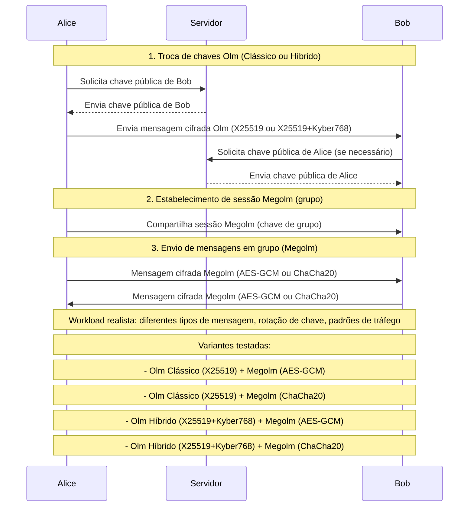

# Experimento de Avaliação de Desempenho Criptográfico no Protocolo Matrix

Este repositório contém um experimento de avaliação de desempenho criptográfico comparativo entre protocolos clássicos e híbridos pós-quânticos em sistemas de mensagens instantâneas baseados no protocolo Matrix.

## Visão Geral

O experimento implementa um simulador de sistema de mensagens baseado nos protocolos Matrix/Olm/Megolm, comparando:

- **Protocolos de Acordo de Chaves**: Olm-Clássico (X25519) vs Olm-Híbrido (X25519 + Kyber768)
- **Algoritmos de Cifra**: AES-GCM, ChaCha20-Poly1305, Megolm-Like (AES-CTR)
- **Cenários de Uso**: Chat P2P, Grupos, Canais, Sistema
- **Workloads Realistas**: Baseados em literatura acadêmica sobre padrões de mensagens instantâneas

## Estrutura do Repositório

```
├── rust_experiment/           # Experimento principal em Rust
│   ├── src/
│   │   ├── main.rs           # Experimento principal
│   │   ├── workload.rs       # Módulo de workload realista
│   ├── Cargo.toml
│   ├── experimento_output.log
├── analysis/                  # Scripts de análise estatística e geração de gráficos
│   ├── gerar_graficos.py      # Geração de gráficos dos resultados
│   ├── testes_hipoteses.py    # Testes estatísticos em Python
│   ├── run_with_venv.sh       # Script para rodar análise com venv
├── results/                   # Resultados dos experimentos (CSV)
│   ├── resultados_normality_check_*.csv
│   ├── graficos/              # Gráficos específicos de resultados
├── plots/                     # Gráficos gerados automaticamente
│   ├── graficos_normality_check_*/
├── README.md                  # Documentação resumida do projeto
├── README_EXPERIMENT.md       # Documentação técnica detalhada
├── REFERENCIAS_ACADEMICAS_WORKLOAD.md  # Referências bibliográficas
├── requirements.txt           # Dependências Python
```

## Execução Rápida

```bash
# Clonar o repositório
git clone <repository-url>
cd matrix

cd rust_experiment
cargo run --release
# Os gráficos são gerados automaticamente após o experimento
```

## Fundamentação Acadêmica

O workload realista foi desenvolvido com base em estudos acadêmicos sobre padrões de uso em sistemas de mensagens instantâneas. As principais referências incluem:

1. **Seufert et al. (2023)**: Análise de 76 milhões de mensagens do WhatsApp
2. **Xiao et al. (2007)**: Caracterização de tráfego em mensagens instantâneas
3. **Keshvadi et al. (2020)**: Análise de performance de aplicações de mensagens
4. **Zhang et al. (2015)**: Medição e análise de aplicações móveis de mensagens
5. **Deng et al. (2017)**: Compreensão de padrões de uso de aplicações móveis
6. **Rammos et al. (2021)**: Caracterização de performance de sistemas modernos de mensagens

Para detalhes completos, consulte `REFERENCIAS_ACADEMICAS_WORKLOAD.md`.

## Características Principais

### Workload Realista
- **Tipos de Mensagens**: Texto (70-80%), Imagem (15-25%), Arquivo (5-10%), Sistema (1-5%)
- **Padrões de Tráfego**: Constante, Burst, Periódico, Aleatório, Realista
- **Cenários**: P2P, Grupos pequenos/médios/grandes, Canais de sistema

### Métricas Coletadas
- Latência de operações KEM e cifra
- Throughput (mensagens/segundo)
- Largura de banda consumida
- Distribuição de tipos de mensagens
- Eficiência energética (throughput/latência)

### Análise Estatística
- 50 repetições por configuração para robustez estatística
  Testes de normalidade (Shapiro-Wilk, Kolmogorov-Smirnov)
  Média, desvio padrão, intervalos de confiança 95%
  Análise de variância (ANOVA)
  Detecção e tratamento de outliers
  Visualizações estatísticas interativas

## Cenários do Workload Realista

O experimento simula diferentes cenários de uso, cada um representando um perfil típico de comunicação em sistemas de mensagens seguros:

### Cenários de Uso

- **SmallChat**: Conversa privada ou grupo pequeno (2-10 usuários). Predominância de mensagens de texto curtas, poucas imagens e raros arquivos/voz. Tráfego constante e baixo volume.
  - *Exemplo: Chat entre amigos, grupo familiar*

- **MediumGroup**: Grupo de tamanho médio (10-50 usuários). Mistura de texto, imagens e arquivos, com tráfego moderado e picos ocasionais (bursts). Uso de stickers, fotos e compartilhamento de documentos.
  - *Exemplo: Grupo de trabalho, sala de aula, equipe de projeto*

- **LargeChannel**: Canal público ou grupo grande (centenas a milhares de usuários). Alto volume de mensagens, grande quantidade de imagens e arquivos, além de mensagens de sistema (avisos, notificações). Tráfego intenso, com bursts e períodos de silêncio.
  - *Exemplo: Canal de anúncios, comunidade aberta, eventos online*

- **SystemChannel**: Canal de mensagens automáticas do sistema. Predominância de mensagens de sistema (notificações, logs, alertas), alguns arquivos de log e raros textos. Tráfego periódico ou aleatório, com picos em eventos específicos (backup, manutenção, alertas).
  - *Exemplo: Logs de auditoria, notificações administrativas, alertas de segurança*

### Padrões de Tráfego
- **Constant**: Fluxo constante de mensagens
- **Burst**: Rajadas intensas seguidas de períodos de silêncio
- **Periodic**: Padrões cíclicos regulares
- **Random**: Distribuição aleatória
- **Realistic**: Baseado em dados empíricos reais

Cada cenário é combinado com diferentes padrões de tráfego para simular situações reais de uso e avaliar o impacto das escolhas criptográficas em ambientes variados.

## Principais Contribuições

1. **Avaliação empírica** comparativa entre Olm clássico e híbrido pós-quântico
2. **Workload fundamentado academicamente** baseado em 6 artigos científicos
3. **Framework extensível** para avaliação de protocolos criptográficos
4. **Métricas abrangentes** para sistemas de mensagens instantâneas
5. **Código aberto** para reprodução e extensão

## Resultados Esperados

O experimento fornece insights sobre:
- Overhead de performance dos algoritmos pós-quânticos
- Trade-offs entre segurança e performance
- Comportamento sob diferentes padrões de uso
- Orientações para migração criptográfica

## Metodologia Experimental

Seguindo a metodologia de Raj Jain para experimentos de sistemas:

1. **Objetivo**: Avaliar o impacto de algoritmos pós-quânticos em sistemas de mensagens
2. **Sistema**: Simulador Matrix/Olm/Megolm em Rust
3. **Métricas**: Latência, throughput, largura de banda, eficiência energética
4. **Fatores**: Protocolo de acordo (X25519 vs X25519+Kyber768), algoritmo de cifra (AES-GCM, ChaCha20, Megolm-Like), cenário de uso, padrão de tráfego
5. **Design**: Experimento fatorial com 50 repetições por configuração
6. **Análise**: Estatística descritiva, testes de normalidade, intervalos de confiança, visualizações

### Tipos de Experimentos

1. **Experimento Básico**: Comparação direta entre algoritmos
2. **Workload Realista**: Simulação de cenários reais de uso
3. **Análise de Normalidade**: Verificação de distribuições estatísticas
4. **Benchmark**: Medição de performance bruta

## Pré-requisitos

### Ambiente de Desenvolvimento

```bash
# Rust (>= 1.70)
curl --proto '=https' --tlsv1.2 -sSf https://sh.rustup.rs | sh
source ~/.cargo/env

# Python (>= 3.8) para análise de dados
sudo apt install python3 python3-pip python3-venv

# Criar ambiente virtual Python
python3 -m venv venv
source venv/bin/activate

# Instalar dependências Python
pip install -r requirements.txt
```

### Dependências Python
- pandas
- matplotlib
- seaborn
- numpy
- scipy
- jupyter (opcional)

## Uso

### Execução do Experimento
```bash
cd rust_experiment
cargo run --release
```

### Geração de Gráficos

Os gráficos são gerados automaticamente após o experimento e salvos na pasta `plots/`. Caso queira gerar gráficos manualmente ou realizar análise Jupyter, utilize os scripts em `analysis/` conforme necessário.

## Estrutura de Resultados

### Arquivos CSV
```csv
cenario,padrao_trafego,acordo,cifra,num_msgs,msgs_por_rotacao,rotacoes,
kem_ms_mean,kem_ms_std,kem_ms_ci95,cipher_ms_mean,cipher_ms_std,cipher_ms_ci95,
kem_bw_mean,kem_bw_std,kem_bw_ci95,msg_bw_mean,msg_bw_std,msg_bw_ci95,
text_msgs,image_msgs,file_msgs,system_msgs
```

### Gráficos Gerados

#### Workload Realista
- Performance por cenário de uso
- Análise por padrão de tráfego  
- Distribuição de tipos de mensagens
- Eficiência energética
- Latência vs throughput
- Comparação de algoritmos
- Análise de acordos de chave

#### Análise de Normalidade
- Testes de normalidade (Shapiro-Wilk, Kolmogorov-Smirnov)
- Q-Q plots
- Histogramas com curvas de normalidade
- Análise de outliers
- Comparação de distribuições
- Boxplots estatísticos
- Análise de variância

## Interpretação dos Resultados

### Métricas-Chave
- **Latência KEM**: Tempo para estabelecer chaves compartilhadas
- **Latência Cifra**: Tempo para criptografar/descriptografar mensagens
- **Throughput**: Mensagens processadas por segundo
- **Overhead Pós-Quântico**: Impacto percentual vs protocolo clássico

### Análise Comparativa
- Olm-Clássico: ~32 bytes de overhead, latência baixa
- Olm-Híbrido: ~2.3KB de overhead, segurança pós-quântica
- AES-GCM vs ChaCha20: Trade-offs hardware/software
- Cenários de uso: Impacto da rotação de chaves

## Limitações e Trabalhos Futuros

### Limitações Atuais
- Simulação em ambiente controlado
- Foco apenas em métricas de performance
- Implementação de referência (não otimizada)
- Workload baseado em padrões publicados

### Extensões Futuras
- Avaliação de outros algoritmos pós-quânticos (NTRU, SABER, CRYSTALS-Dilithium)
- Análise de consumo energético em dispositivos móveis
- Testes em ambiente distribuído real
- Integração com implementações Matrix/Element oficiais
- Análise de aspectos de segurança além da performance
- Avaliação de resistência a ataques quânticos

## Fluxo de Comunicação Experimental

O experimento simula a troca de mensagens seguras entre dois participantes fictícios (**Alice** e **Bob**) para avaliar o desempenho das operações criptográficas:

### Diagrama de Sequência



### Explicação do Diagrama

O diagrama acima ilustra o protocolo de comunicação segura Matrix/Olm/Megolm que é simulado no experimento. Cada etapa representa um ponto de medição crucial para avaliar o impacto dos algoritmos pós-quânticos:

#### **Fase 1: Estabelecimento de Chaves Olm (Acordo P2P)**
- **Alice** solicita a chave pública de **Bob** ao servidor
- O servidor responde com a chave pública (overhead de rede medido)
- **Alice** envia sua primeira mensagem cifrada usando **Olm** (X25519 clássico ou X25519+Kyber768 híbrido)
- **Métricas coletadas**: Latência do KEM, largura de banda do acordo de chaves, tempo de estabelecimento da sessão

#### **Fase 2: Sessão Megolm (Comunicação em Grupo)**
- **Alice** compartilha a chave de sessão Megolm com **Bob** para comunicação em grupo
- Esta chave simétrica será usada para cifrar/decifrar mensagens subsequentes
- **Métricas coletadas**: Overhead de distribuição de chaves, tempo de sincronização

#### **Fase 3: Troca de Mensagens (Workload Realista)**
- Mensagens são trocadas bidirecionalmente usando cifra simétrica (AES-GCM, ChaCha20-Poly1305, ou Megolm-Like)
- Diferentes tipos de mensagens são processados conforme o workload: texto, imagem, arquivo, sistema
- **Métricas coletadas**: Latência de cifragem/decifragem, throughput, largura de banda por tipo de mensagem

#### **Relação com o Experimento**

1. **Comparação Clássico vs Pós-Quântico**: 
   - **Olm Clássico (X25519)**: ~32 bytes de overhead, latência baixa
   - **Olm Híbrido (X25519+Kyber768)**: ~2.3KB de overhead, segurança pós-quântica

2. **Avaliação de Cifras Simétricas**:
   - **AES-GCM**: Otimizado para hardware com suporte AES-NI
   - **ChaCha20-Poly1305**: Melhor performance em software
   - **Megolm-Like**: Implementação específica do protocolo Matrix

3. **Cenários de Workload**:
   - **SmallChat**: Poucas mensagens P2P, foco no overhead inicial
   - **MediumGroup**: Equilíbrio entre estabelecimento e troca de mensagens
   - **LargeChannel**: Alto volume de mensagens, múltiplas rotações de chave
   - **SystemChannel**: Mensagens automáticas, padrões previsíveis

4. **Pontos de Medição**:
   - **Latência KEM**: Tempo para estabelecer chaves compartilhadas (Fase 1)
   - **Latência Cifra**: Tempo para processar mensagens individuais (Fase 3)
   - **Throughput**: Mensagens processadas por segundo durante comunicação contínua
   - **Largura de Banda**: Overhead de protocolo vs payload útil

#### **Rotação de Chaves**

O experimento simula rotação periódica de chaves Megolm (a cada N mensagens), retornando à **Fase 2** para redistribuir novas chaves. Isso permite avaliar:
- Impacto da frequência de rotação na performance
- Overhead acumulado em cenários de longo prazo
- Comportamento sob diferentes políticas de segurança

Esta simulação fornece uma avaliação abrangente do impacto dos algoritmos pós-quânticos em sistemas de mensagens instantâneas reais, considerando tanto operações criptográficas quanto padrões de uso típicos.

### Etapas do Experimento

1. **Geração do Workload**: Cria sequência de mensagens com tipos e padrões realistas
2. **Acordo de Chaves**: Estabelece chaves criptográficas (Olm-Clássico ou Olm-Híbrido)
3. **Envio de Mensagens**: Alice cifra e envia; Bob recebe e decifra
4. **Coleta de Métricas**: Medição contínua de latência, throughput e largura de banda
5. **Rotação de Chaves**: Renovação periódica conforme política experimental
6. **Análise Estatística**: Processamento e visualização dos resultados

### Resumo do Fluxo

- O **Workload** define o que será enviado
- **Alice** executa as operações de cifragem e envio
- **Bob** executa as operações de decifragem e recebimento
- O sistema coleta métricas de desempenho em cada etapa

## Reprodução e Extensão

O experimento foi projetado para ser:
- **Reproduzível**: Sementes fixas, ambiente controlado
- **Extensível**: Módulos independentes, interfaces bem definidas
- **Documentado**: Código comentado, documentação técnica completa
- **Validado**: Testes unitários, verificação de consistência

### Adicionando Novos Algoritmos
```rust
// Em workload.rs
pub enum NewCipherAlgorithm {
    ExistingAlg,
    NewPostQuantumAlg,
}

// Implementar trait CipherProtocol
impl CipherProtocol for NewPostQuantumAlg {
    fn encrypt(&self, key: &[u8], plaintext: &[u8]) -> Vec<u8> {
        // Implementação
    }
}
```

## Licença e Contribuições

- **Licença**: MIT License
- **Contribuições**: Pull requests bem-vindos
- **Issues**: Reportar bugs ou sugestões
- **Documentação**: Manter atualizada com mudanças

## Citação

Se utilizar este trabalho em pesquisa acadêmica, por favor cite:

```bibtex
@misc{matrix_crypto_experiment_2025,
  title={Experimento de Avaliação de Desempenho Criptográfico: Protocolos Clássicos versus Híbridos Pós-Quânticos em Sistemas de Mensagens Instantâneas},
  author={Marcos Dantas Ortiz},
  year={2025},
  url={https://github.com/[usuario]/matrix_experiment}
}
```

## Contato

- **Autor**: Marcos Dantas Ortiz
- **Email**: [email]
- **Instituição**: [instituição]

---

## Documentação Adicional

Para informações técnicas detalhadas, consulte:

- **[README_EXPERIMENT.md](README_EXPERIMENTO.md)**: Documentação técnica completa
- **[INSIGHTS_ARTIGOS_WORKLOAD.md](INSIGHTS_ARTIGOS_WORKLOAD.md)**: Fundamentação acadêmica
- **[REFERENCIAS_ACADEMICAS_WORKLOAD.md](REFERENCIAS_ACADEMICAS_WORKLOAD.md)**: Referências bibliográficas

## Requisitos
- Rust (>= 1.70)
- Python (>= 3.8)
- Bibliotecas Python: pandas, matplotlib, seaborn, numpy, scipy
- (Opcional) Jupyter Notebook

## Autor
**Marcos Dantas Ortiz**  
Julho de 2025 