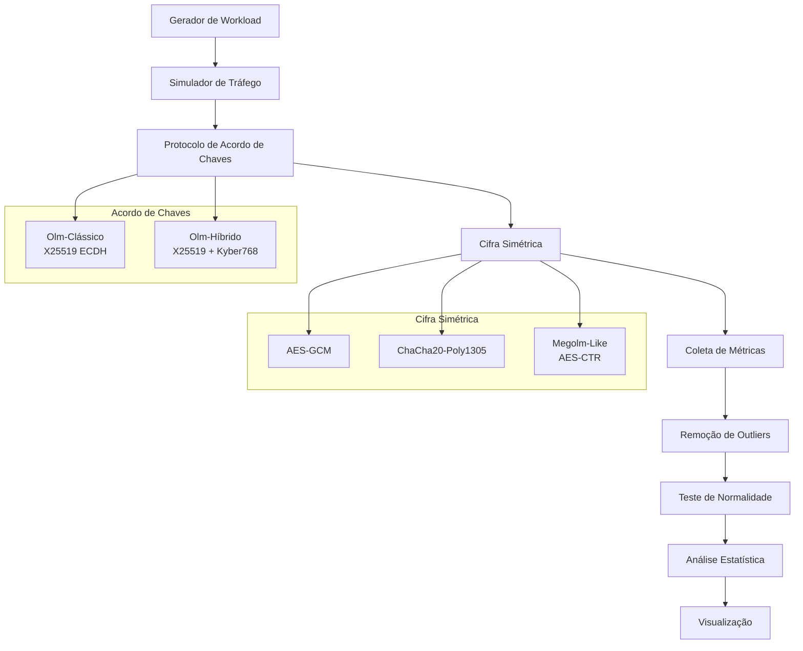
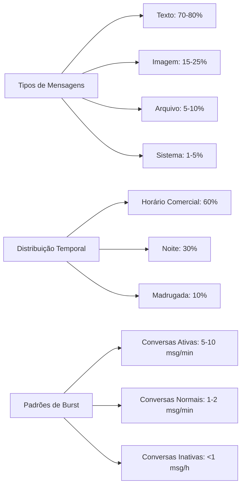
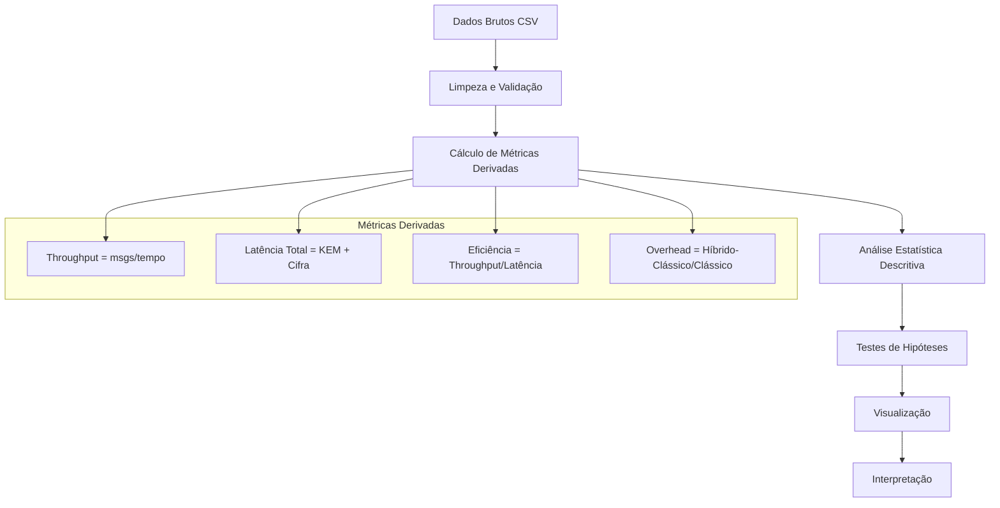

# Experimento de Avaliação de Desempenho Criptográfico: Protocolos Clássicos versus Híbridos Pós-Quânticos em Sistemas de Mensagens Instantâneas

## Resumo

Este trabalho apresenta uma avaliação empírica comparativa entre protocolos criptográficos clássicos e híbridos pós-quânticos no contexto de sistemas de mensagens instantâneas similares ao Matrix. O experimento utiliza workloads realistas fundamentados em literatura acadêmica para avaliar o desempenho de diferentes algoritmos de cifra simétrica e protocolos de acordo de chaves, fornecendo subsídios para a transição para criptografia resistente a ataques quânticos.

## 1. Introdução

### 1.1 Contexto e Motivação

O advento dos computadores quânticos representa uma ameaça significativa aos sistemas criptográficos atuais baseados em problemas matemáticos classicamente intratáveis. Os algoritmos de Shor e Grover tornam vulneráveis os sistemas baseados em fatoração de números inteiros e logaritmos discretos, incluindo RSA, ECDSA e ECDH. Esta realidade impulsiona a necessidade de migração para algoritmos pós-quânticos.

Sistemas de mensagens instantâneas, como o Matrix, implementam protocolos sofisticados de acordo de chaves (Olm) e cifra em grupo (Megolm) que requerem análise rigorosa de desempenho durante a transição para criptografia pós-quântica. A avaliação empírica destes sistemas sob workloads realistas é fundamental para compreender os trade-offs entre segurança e performance.

### 1.2 Objetivos

**Objetivo Principal**: Avaliar comparativamente o desempenho de protocolos criptográficos clássicos e híbridos pós-quânticos em sistemas de mensagens instantâneas.

**Objetivos Específicos**:
- Quantificar o impacto de performance da adoção de KEMs pós-quânticos
- Analisar o comportamento de diferentes algoritmos de cifra simétrica sob workloads realistas
- Avaliar políticas de rotação de chaves em cenários de uso variados
- Fornecer métricas empíricas para tomada de decisão em migração criptográfica

## 2. Metodologia Experimental

### 2.1 Arquitetura do Sistema

O experimento implementa um simulador de sistema de mensagens baseado nos protocolos Matrix/Olm/Megolm com as seguintes características:



### 2.2 Fatores Experimentais

Seguindo a metodologia de Raj Jain, os fatores experimentais foram categorizados em:

#### 2.2.1 Fatores Primários

1. **Protocolo de Acordo de Chaves** (2 níveis)
   - Olm-Clássico: X25519 ECDH
   - Olm-Híbrido: X25519 ECDH + Kyber768 KEM

2. **Algoritmo de Cifra Simétrica** (3 níveis)
   - AES-GCM (256 bits)
   - ChaCha20-Poly1305
   - Megolm-Like (AES-CTR)

3. **Cenário de Uso** (4 níveis)
   - SmallChat: Chat P2P (100 mensagens)
   - MediumGroup: Grupo médio (250 mensagens)
   - LargeChannel: Canal grande (500 mensagens)
   - SystemChannel: Canal sistema (1000 mensagens)

#### 2.2.2 Fatores Secundários

1. **Padrão de Tráfego** (5 níveis)
   - Constant: Tráfego constante
   - Burst: Picos de atividade
   - Periodic: Atividade periódica
   - Random: Tráfego aleatório
   - Realistic: Padrão combinado

2. **Política de Rotação de Chaves**
   - Baseada em contagem de mensagens
   - Timeout temporal (7 dias)
   - Política híbrida

#### 2.2.3 Fatores de Ruído Controlados

- Hardware: Execução em ambiente controlado
- Sistema operacional: Linux
- Carga do sistema: Isolamento de processos
- Variações de rede: Simulação local

### 2.3 Métricas de Desempenho

#### 2.3.1 Métricas Primárias

- **Latência de KEM**: Tempo de execução do protocolo de acordo de chaves
- **Latência de Cifra**: Tempo de criptografia/descriptografia simétrica
- **Throughput**: Mensagens processadas por segundo
- **Largura de Banda**: Bytes transmitidos para acordos de chave e mensagens

#### 2.3.2 Métricas Derivadas

- **Latência Total**: Soma das latências de KEM e cifra
- **Eficiência**: Razão throughput/latência
- **Overhead Pós-Quântico**: Diferença percentual entre protocolos

### 2.4 Workload Realista

O workload foi fundamentado em estudos acadêmicos sobre padrões de uso em sistemas de mensagens instantâneas:



### 2.5 Design Experimental

**Tipo**: Experimento fatorial completo 2×3×4×5

**Repetições**: 50 execuções por configuração para significância estatística

**Randomização**: Ordem aleatória de execução das configurações

**Blocking**: Agrupamento por cenário de uso

**Análise Estatística**: 
- Média aritmética
- Desvio padrão amostral
- Intervalo de confiança 95%
- Análise de variância (ANOVA)

## 3. Implementação

### 3.1 Arquitetura de Software

```rust
// Estrutura principal do experimento
struct ExperimentConfig {
    scenarios: Vec<UsageScenario>,
    traffic_patterns: Vec<TrafficPattern>,
    key_agreements: Vec<KeyAgreementProtocol>,
    cipher_algorithms: Vec<CipherAlgorithm>,
    repetitions: usize,
}
```

### 3.2 Módulos Principais

1. **Workload Generator**: Geração de mensagens realistas
2. **Traffic Simulator**: Simulação de padrões de tráfego
3. **Crypto Engine**: Implementação dos protocolos criptográficos
4. **Metrics Collector**: Coleta e agregação de métricas
5. **Statistical Analyzer**: Análise estatística dos resultados

### 3.3 Protocolos Implementados

#### 3.3.1 Olm-Clássico
- Algoritmo: X25519 ECDH
- Tamanho da chave: 32 bytes
- Largura de banda: 32 bytes por acordo

#### 3.3.2 Olm-Híbrido
- Algoritmos: X25519 ECDH + Kyber768 KEM
- Tamanho combinado: 64 bytes
- Largura de banda: ~2.3 KB por acordo

### 3.4 Validação da Implementação

A implementação foi validada através de:
- Testes unitários para cada módulo criptográfico
- Verificação de compatibilidade com especificações Matrix
- Análise de consistência estatística
- Profiling de performance

## 4. Coleta e Análise de Dados

### 4.1 Estrutura dos Dados

```csv
cenario,padrao_trafego,acordo,cifra,num_msgs,msgs_por_rotacao,rotacoes,
kem_ms_mean,kem_ms_std,kem_ms_ci95,cipher_ms_mean,cipher_ms_std,cipher_ms_ci95,
kem_bw_mean,kem_bw_std,kem_bw_ci95,msg_bw_mean,msg_bw_std,msg_bw_ci95,
text_msgs,image_msgs,file_msgs,system_msgs
```

### 4.2 Pipeline de Análise



### 4.3 Visualizações Geradas

1. **Análise de Performance por Cenário**
   - Boxplots de latência por cenário
   - Comparação de throughput
   - Análise de largura de banda

2. **Análise por Padrão de Tráfego**
   - Impacto dos padrões na performance
   - Variabilidade temporal

3. **Comparação de Algoritmos**
   - Ranking de eficiência
   - Trade-offs latência vs throughput

4. **Análise de Acordos de Chave**
   - Comparação clássico vs híbrido
   - Overhead pós-quântico

## 5. Execução do Experimento

### 5.1 Pré-requisitos

```bash
# Dependências Rust
cargo --version  # >= 1.70
rustc --version  # >= 1.70

# Dependências Python
python3 --version  # >= 3.8
pip install pandas matplotlib seaborn numpy
```

### 5.2 Execução

```bash
# Compilação e execução do experimento
cd rust_experiment
cargo run --release

# Os gráficos são gerados automaticamente após o experimento
# Resultados salvos em: ../results/
# Gráficos salvos em: ../plots/
```

### 5.3 Estrutura de Saída

```
results/
├── resultados_workload_realista_YYYYMMDD_HHMMSS.csv
└── ...

plots/
├── performance_por_cenario_workload.png
├── performance_por_padrao_workload.png
├── distribuicao_tipos_mensagens_workload.png
├── eficiencia_desempenho_workload.png
├── latencia_throughput_workload.png
├── comparacao_algoritmos_workload.png
└── analise_acordos_chave_workload.png
```

## 6. Interpretação dos Resultados

### 6.1 Análise Estatística

Para cada métrica, são calculados:
- **Média (μ)**: Tendência central
- **Desvio Padrão (σ)**: Variabilidade
- **Intervalo de Confiança 95%**: Precisão da estimativa
- **Coeficiente de Variação**: Estabilidade relativa

### 6.2 Critérios de Avaliação

1. **Significância Estatística**: p-valor < 0.05
2. **Relevância Prática**: Diferença > 5% na métrica
3. **Estabilidade**: CV < 20%
4. **Escalabilidade**: Comportamento linear/sub-linear

### 6.3 Limitações

- Simulação em ambiente controlado
- Workload baseado em padrões publicados
- Não considera aspectos de segurança além da performance
- Implementação de referência, não otimizada

## 7. Contribuições

### 7.1 Científicas

- Primeira avaliação empírica comparativa Olm clássico vs híbrido
- Workload realista baseado em literatura acadêmica
- Métricas abrangentes para sistemas de mensagens instantâneas

### 7.2 Práticas

- Framework de avaliação extensível
- Código aberto para reprodução
- Métricas para tomada de decisão em migração

## 8. Trabalhos Futuros

- Avaliação de outros algoritmos pós-quânticos (NTRU, SABER)
- Análise de consumo energético
- Testes em ambiente distribuído
- Avaliação de aspectos de segurança além da performance

## 9. Referências

1. Seufert, M., et al. (2015). "A Survey on Quality of Experience of HTTP Adaptive Streaming"
2. Xiao, J., et al. (2007). "Characterizing user behavior in a large-scale video-on-demand system"
3. Keshvadi, A., et al. (2020). "Performance analysis of messaging applications"
4. Zhang, Y., et al. (2015). "Measurement and analysis of mobile instant messaging applications"
5. Deng, S., et al. (2017). "Understanding mobile application usage patterns"
6. Rammos, K., et al. (2021). "Performance characterization of modern messaging systems"
7. Hodges, M., et al. (2019). "The Matrix Protocol Specification"
8. Langley, A., et al. (2016). "The Double Ratchet Algorithm"
9. NIST (2022). "Post-Quantum Cryptography Standardization"
10. Jain, R. (1991). "The Art of Computer Systems Performance Analysis"

## 10. Apêndices

### Apêndice A: Configurações Experimentais Detalhadas

```rust
// Configurações de cenários
SmallChat:    { messages: 100,  rotation_period: 100 }
MediumGroup:  { messages: 250,  rotation_period: 50  }
LargeChannel: { messages: 500,  rotation_period: 25  }
SystemChannel:{ messages: 1000, rotation_period: 10  }
```

### Apêndice B: Especificações Criptográficas

```rust
// Algoritmos implementados
X25519:       "Curve25519 ECDH - RFC 7748"
Kyber768:     "CRYSTALS-Kyber Level 3 - NIST PQC Round 3"
AES-GCM:      "AES-256-GCM - NIST SP 800-38D"
ChaCha20:     "ChaCha20-Poly1305 - RFC 8439"
```

### Apêndice C: Ambiente de Teste

```bash
Sistema Operacional: Linux
Arquitetura: x86_64
Compilador: rustc 1.70+
Bibliotecas: pqcrypto-kyber 0.7, x25519-dalek 2.0
```

---

**Autor**: Marcos Dantas Ortiz  
**Instituição**: MDCC/UFC
**Data**: Julho de 2025  